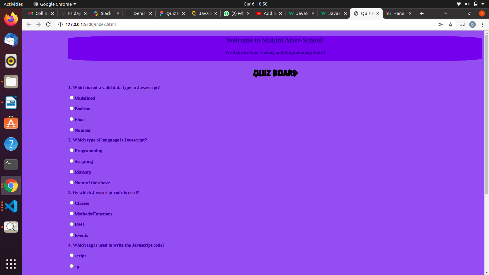

ReadMe.md

Portfolio
##### DENIS MUGA
### A Description of Quiz Board Web Application 
## Table of Content
+ [Description](#description)
+ [Installation Requirement]( Requisites)
+ [Technology Used](technology-used)
+ [Live-links] (#Live links)
+ [Reference](#reference)
+ [Licence](#licence)
+ [Authors Info](#aut)

##Description
The aim of this project is to create a QUIZ BOARD using HTML, CSS, and JavaScript concepts. The project ensures best user experience by ensuring that students can answer various multiple choice questions and get their scores after the application computes their final score. Besides the QUIZ BOARD alerts the students by letting them know whether they have passed excellently, fairly, or poorly depending on their score percentages. A poor score below 50% alerts students to retake the test. The project is primarly designed for desktops.
-This is the desktop rendition.
## Set-up
### Vitals
* A computer or a desktop in good working condition.
* A stable internet connection to enable continuous adding and commiting HTML and CSS changes into the project's repository.
### Installation Process
* A mandatory git initialization at the beginning of the project to enable adding and commiting changes to external (remote) repository.
* A mandatory Node.js installation to run the JavaScript files.
## Technology Used
* Vanilla HTML is essential in building this project.
* CSS for styling the webpage by incorporating key concepts such as align-contents, width, classes, IDs, and background color, among others.
* JavaScript language to facilitate interactivity with the users.
## The live link
To get a demenonstration of the final deployment of my page please follow this link
The demonstration of the project's live deployment is available in the link below:
[live-link](https://denismuga.github.io/IP-Quiz-Board/)
  ## Licence
MIT License
Copyright (c) [2022] [Denis Muga]
Permission is  granted, free of charge, to any person obtaining a copy
of this software and associated documentation files (the "Software"), to deal
in the Software without restriction, including without limitation the rights
to use, copy, modify, merge, publish, distribute, sublicense, and/or sell
copies of the Software, and to permit persons to whom the Software is
furnished to do so, subject to the following conditions:
The above copyright notice and this permission notice shall be included in all
copies or substantial portions of the Software.
THE SOFTWARE IS PROVIDED "AS IS", WITHOUT WARRANTY OF ANY KIND, EXPRESS OR
IMPLIED, INCLUDING BUT NOT LIMITED TO THE WARRANTIES OF MERCHANTABILITY,
FITNESS FOR A PARTICULAR PURPOSE AND NONINFRINGEMENT. IN NO EVENT SHALL THE
AUTHORS OR COPYRIGHT HOLDERS BE LIABLE FOR ANY CLAIM, DAMAGES OR OTHER
LIABILITY, WHETHER IN AN ACTION OF CONTRACT, TORT OR OTHERWISE, ARISING FROM,
OUT OF OR IN CONNECTION WITH THE SOFTWARE OR THE USE OR OTHER DEALINGS IN THE
SOFTWARE.
## Authors Info
Slack Profile - Denis Muga.
LinkedIn - (Denis Muga: https://www.linkedin.com/in/denis-mugah-0595b655/)
Email - denismugah5@gmail.com